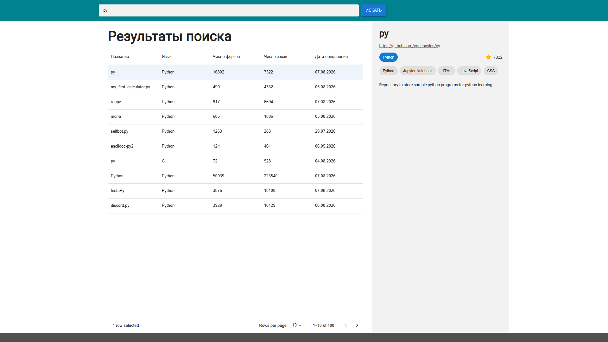

# 🔍 GitHubRepoFinder

Поиск репозиториев GitHub через GraphQL API с выводом результатов в таблицу.


🔗 **[Живое демо](https://nextjs-githubrepofinder.vercel.app/)**



## Возможности

- Поиск репозиториев через GitHub GraphQL API
- Таблица результатов на MUI DataGrid: сортировка, пагинация
- Панель с краткой информацией о выбранном репозитории
- Переход на страницу репозитория

## Стек

Next.js · TypeScript · graphql-request · Redux Toolkit · MUI X DataGrid

## Создание токена

GitHub предлагает два типа токенов. Здесь подойдёт fine-grained — он выдаёт ровно те права, которые нужны, и не больше.

1. Открой github.com/settings/personal-access-tokens/new Тот же путь через интерфейс: аватар → Settings → внизу слева Developer settings → Personal access tokens → Fine-grained tokens → Generate new token
2. Token name — любое понятное, например repo-finder-local
3. Expiration — 30 или 90 дней. Вариант «No expiration» лучше не выбирать: бессрочный токен, который однажды утечёт, останется рабочим навсегда
4. Repository access — выбери Public Repositories (read-only) Это ключевой пункт. Приложение только ищет чужие публичные репозитории и читает их описание, звёзды и языки. Доступ к твоим собственным репозиториям ему не нужен
5. Permissions — ничего не добавляй. При выборе «Public Repositories (read-only)» GitHub сам проставит минимальный набор прав только на чтение
6. Нажми Generate token внизу страницы
7. Скопируй токен сразу — он показывается один раз. Начинается с github*pat*

## Запуск

```bash
npm install
cp .env.example .env
npm run dev
```

## Что можно улучшить

Токен сейчас попадает в клиентский бандл — запросы стоит проксировать через API-роут.
